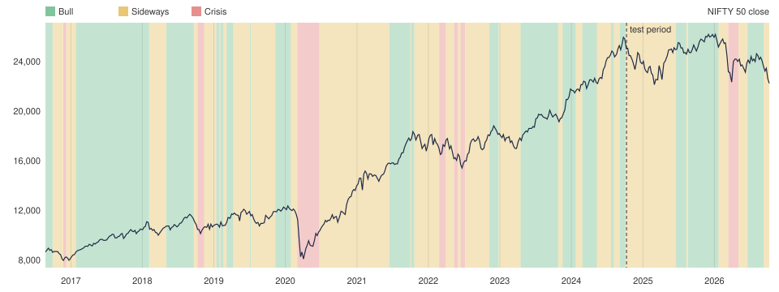

# Model validation

Generated by `uv run mm-train`; do not edit by hand. Method and decisions:
[ADR 0001](adr/0001-regime-model.md).

**Released model:** `hmm-20261008-c2` (configuration C2: log-transform, 8 features, diagonal covariance).
**Status:** experimental — at least one Gate G2 target is not met.

Training data 2016-08-24 to 2024-10-08 (2001 days); test data 2024-10-09 to 2026-10-08 (495 days). The HMM, the scaler and the state names are fitted on training days only.
Best of 10 seeds: seed 1, training log-likelihood -17042.994.

## Gate G2

| Target | Result | Pass |
|---|---|---|
| Reference periods >= 5 of 6 | 5 of 6 | yes |
| Macro-F1 vs reference labels >= 0.60 | 0.553 | **no** |
| Surrogate fidelity >= 95% | 99.3% | yes |
| Confirmed switches per year (test) < 12 | 4.1 | yes |
| 2020 crash transition lag <= 7 trading days | 0 | yes |

## Reference periods (confirmed labels, causal)

| Period | Event | Expected | Model (share of days) | Correct |
|---|---|---|---|---|
| 2017-01-01 to 2018-01-31 | Steady low-volatility rally | Bull | Bull (93%) | yes |
| 2018-09-01 to 2018-10-31 | IL&FS credit scare | Crisis or Sideways | Crisis (38%) | yes |
| 2020-03-01 to 2020-04-30 | COVID crash | Crisis | Crisis (97%) | yes |
| 2020-06-01 to 2021-10-31 | Post-COVID bull run | Bull | Sideways (71%) | **no** |
| 2022-01-01 to 2022-06-30 | Rate hikes, Russia-Ukraine | Crisis or Sideways | Sideways (63%) | yes |
| 2023-04-01 to 2023-12-31 | Broad rally to new highs | Bull | Bull (88%) | yes |

All six periods fall inside the training window. The labels are causal (each day uses only
data up to that day), but the model's parameters were learnt from the training years, so this
is an in-sample check. The walk-forward section below is the fully out-of-sample one.

## Fully out-of-sample check (walk-forward)

Each year from 2019 is labelled by a model refitted (scaler, HMM, state names) on
the earlier years only, so no day was seen by the model that labels it. Not used to pick the model.

| Period | Expected | Model (share of days) | Correct |
|---|---|---|---|
| 2020-03-01 to 2020-04-30 | Crisis | Crisis (100%) | yes |
| 2020-06-01 to 2021-10-31 | Bull | Sideways (40%) | **no** |
| 2022-01-01 to 2022-06-30 | Crisis or Sideways | Sideways (94%) | yes |
| 2023-04-01 to 2023-12-31 | Bull | Bull (88%) | yes |

2019-01-02 to 2026-10-08: 3 of 4 periods correct, macro-F1 0.474, 5.8 confirmed switches per year, 2020 transition lag 0 trading days.

## Agreement with the objective reference labels

Macro-F1: model 0.553 (all days), 0.436 (test period); simple rule-based benchmark 0.658.

Confusion matrix, rows = reference label, columns = model's confirmed label:

| Reference \ Model | Bull | Sideways | Crisis |
|---|---|---|---|
| Bull | 621 | 603 | 22 |
| Sideways | 411 | 617 | 79 |
| Crisis | 0 | 18 | 85 |

Benchmark (VIX > 25 and drawdown_60d < -10% → Crisis; sharpe_60d > 0 → Bull; else Sideways):

| Reference \ Model | Bull | Sideways | Crisis |
|---|---|---|---|
| Bull | 995 | 251 | 0 |
| Sideways | 674 | 433 | 0 |
| Crisis | 25 | 7 | 71 |

## Stability, confidence, explanations

- Confirmed regime switches per year: 4.1 (test), 5.2 (all days).
- Days per confirmed label: Bull 1052, Sideways 1258, Crisis 186.
- Mean confidence (filtered probability of the label shown): 0.97. HMM probabilities are overconfident; treat them as a ranking, not a calibrated chance.
- Surrogate fidelity: 99.3% on all days; 91.9% on the test period when trained on the training period only.
- Latest day 2026-10-08: Sideways (confidence 1.00).

## Backtest (research result, not advice)

100% NIFTY in Bull, 60% in Sideways, 30% in Crisis, rest at 6% a year; 1-day delay; 0.1% costs;
price index without dividends.

| Period | Strategy CAGR | Buy-and-hold CAGR | Strategy max drawdown | Buy-and-hold max drawdown | Strategy Sharpe | Buy-and-hold Sharpe | Weight changes |
|---|---|---|---|---|---|---|---|
| All days | 9.2% | 10.0% | -15.7% | -38.4% | 0.35 | 0.31 | 51 |
| Test period | -3.1% | -5.8% | -11.9% | -15.6% | -1.01 | -0.83 | 8 |

## Validation chart

## Every configuration in the sweep (pre-registered, in priority order)

| Config | Description | Periods | Macro-F1 | Fidelity | Switches/yr (test) | 2020 lag | All gates |
|---|---|---|---|---|---|---|---|
| C1 | log-transform, 8 features, full covariance (primary) | 4/6 | 0.442 | 97.6% | 6.1 | 0 | no |
| C2 (released) | log-transform, 8 features, diagonal covariance | 5/6 | 0.553 | 99.3% | 4.1 | 0 | no |
| C3 | log-transform, 7 features (no bb_width), full covariance | 5/6 | 0.499 | 98.0% | 9.2 | 0 | no |
| C4 | log-transform, 6 features (no bb_width, vix_change_30d), full | 4/6 | 0.286 | 97.9% | 8.2 | 0 | no |
| C5 | log-transform, 8 features, full covariance, 4 states | 4/6 | 0.480 | 99.0% | 5.6 | 0 | no |
| C6 | no transform, 8 features, full covariance | 5/6 | 0.457 | 98.5% | 5.6 | 5 | no |
| C7 | log-transform, 4 core features, full covariance | 5/6 | 0.343 | 97.2% | 6.1 | 0 | no |

Selection rule (fixed before the sweep): the first configuration that passes every gate; if none
does, the most reference periods correct, then the highest macro-F1.
